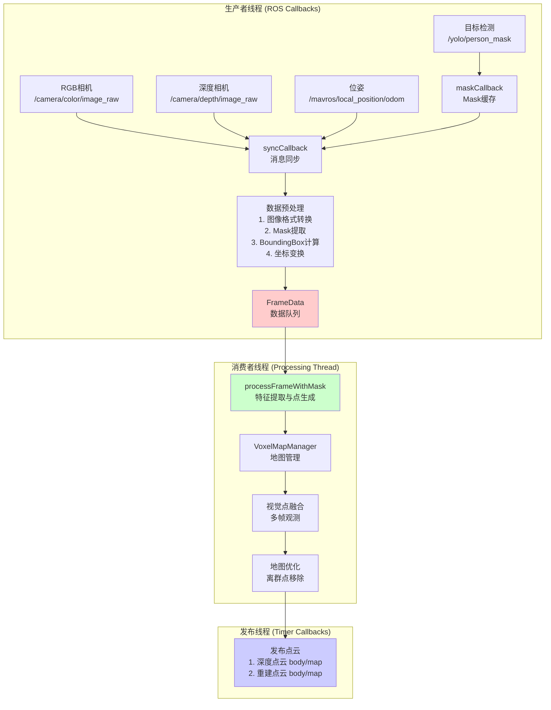
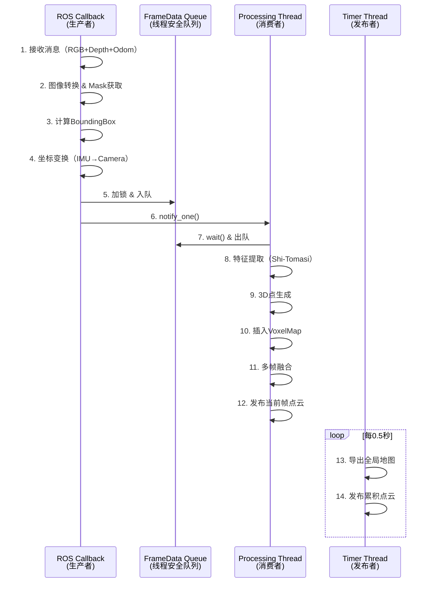
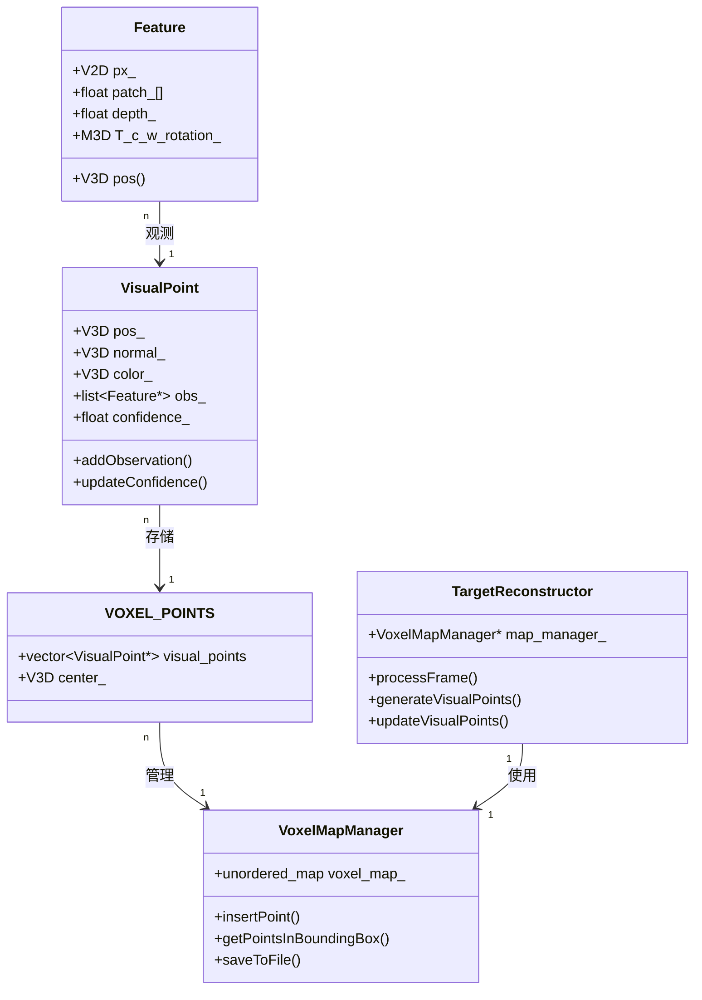
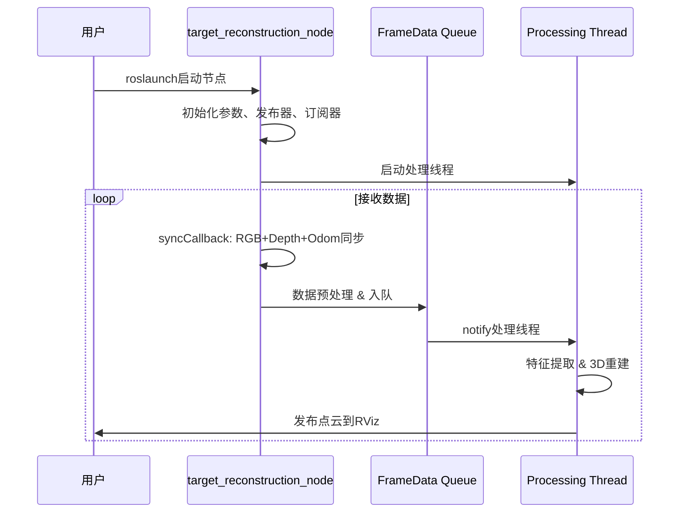

# Target Reconstruction Framework

基于 FAST-LIVO2 视觉地图管理框架的静态目标重建系统

## 📁 项目结构

```
target_restruction/
├── include/
│   ├── common_lib.h              # 通用数据类型和常量
│   ├── feature.h                 # 单帧观测Feature
│   ├── visual_point.h            # 3D视觉地图点
│   ├── voxel_map.h               # 体素地图管理
│   └── target_reconstructor.h   # 主重建类
└── src/
    ├── feature.cpp               # Feature实现（待实现）
    ├── visual_point.cpp          # VisualPoint实现（待实现）
    ├── voxel_map.cpp             # VoxelMapManager实现（待实现）
    ├── target_reconstructor.cpp  # TargetReconstructor实现（待实现）
    └── main.cpp                  # 主程序入口（待实现）
```

## 🎯 核心设计思想

### 1. 数据流（生产者-消费者架构）



**关键特性**：
- 🔄 **异步处理**：回调函数只负责数据同步和入队，不阻塞ROS消息接收
- 📦 **队列缓冲**：`std::deque<FrameData>` 存储待处理帧，支持丢帧策略
- 🧵 **线程安全**：使用 `std::mutex` 和 `std::condition_variable` 保护队列
- ⚡ **实时性**：处理线程独立运行，避免回调函数耗时过长

### 2. FrameData 结构（队列元素）

```cpp
struct FrameData {
    cv::Mat rgb_img;              // RGB图像
    cv::Mat depth_img;            // 深度图像
    cv::Mat mask;                 // 目标分割mask（255=人，0=背景）
    BoundingBox bbox;             // 从mask计算的包围框
    
    // 相机位姿（World to Camera）
    Eigen::Matrix3d camera_R;     // 相机到世界的旋转 (R_c_w)
    Eigen::Vector3d camera_t;     // 相机在世界坐标系的位置 (t_c_w)
    
    // 机体位姿（用于点云变换）
    Eigen::Matrix3d R_w_i;        // 世界到IMU的旋转
    Eigen::Vector3d t_w_i;        // IMU在世界坐标系的位置
    
    double timestamp;             // 时间戳
};
```

**队列管理策略**：
- 最大队列长度：10帧（可配置）
- 丢帧策略：队列满时丢弃最旧的帧
- 线程同步：`std::condition_variable` 通知处理线程

### 3. 线程模型



### 4. 核心类关系



## 📐 坐标系与变换

### 坐标系定义


**变换关系**：
- `R_i_c = [0, 0, 1; -1, 0, 0; 0, -1, 0]` - IMU到相机旋转
- `t_i_c = [0.1, 0, 0]` - IMU到相机平移（米）
- `R_c_w = R_w_i * R_i_c` - 相机到世界旋转
- `t_c_w = R_w_i * t_i_c + t_w_i` - 相机在世界坐标系的位置

### 关键公式

**像素 → 世界坐标**（深度已知）：
```cpp
// 1. 像素 → 归一化平面
double x_norm = (u - cx) / fx;
double y_norm = (v - cy) / fy;

// 2. 归一化平面 → 相机坐标
V3D p_camera(x_norm * depth, y_norm * depth, depth);

// 3. 相机坐标 → 世界坐标
V3D p_world = R_c_w * p_camera + t_c_w;
```

**世界坐标 → 像素**（重投影）：
```cpp
// 1. 世界坐标 → 相机坐标
V3D p_camera = R_c_w.transpose() * (p_world - t_c_w);

// 2. 相机坐标 → 归一化平面
double x_norm = p_camera.x() / p_camera.z();
double y_norm = p_camera.y() / p_camera.z();

// 3. 归一化平面 → 像素
double u = fx * x_norm + cx;
double v = fy * y_norm + cy;
```

## 🔑 关键改进点（相比FAST-LIVO2）

### ✅ 针对静态目标优化

| 特性 | FAST-LIVO2 | Target Reconstruction |
|------|-----------|----------------------|
| **应用场景** | 动态SLAM | 静态目标重建 |
| **传感器** | LiDAR + IMU + 相机 | RGB-D相机 |
| **位姿来源** | IMU预积分 + ESIKF | 外部位姿（ORB-SLAM等） |
| **体素大小** | 0.5m（大场景） | 0.05m（精细重建） |
| **观测数量** | 快速收敛（<10帧） | 充分观测（>30帧） |
| **颜色信息** | 无 | RGB颜色融合 |
| **目标过滤** | 无 | 检测框内点云 |

### ✅ 新增功能

1. **颜色重建**：`VisualPoint` 增加 `V3D color_` 和 `updateColor()`
2. **目标框过滤**：`VoxelMapManager::getPointsInBoundingBox()`
3. **置信度评估**：基于观测次数和几何一致性的 `confidence_` 评分
4. **TSDF融合**（可选）：支持体积重建
5. **质量控制**：`checkGeometricConsistency()` 和离群点检测

## 📊 内存管理机制

### 指针共享策略（继承自FAST-LIVO2）

```cpp
// 1. 创建视觉点（堆分配）
VisualPoint* pt = new VisualPoint(pos);

// 2. 插入全局地图（地图拥有所有权）
map_manager_->insertPoint(pt);  
// 内部：voxel_map_[voxel_loc]->visual_points.push_back(pt);

// 3. 临时检索（共享指针，不拷贝对象）
std::vector<VisualPoint*> visible_pts = map_manager_->getPointsInBoundingBox(...);

// 4. 更新点属性（通过任一指针修改，全局可见）
for (auto pt : visible_pts) {
    pt->addObservation(ftr);  // 修改原对象
    pt->updateConfidence();
}

// 5. 地图负责释放（析构时）
// ~VOXEL_POINTS() { for (auto vp : visual_points) delete vp; }
```

**关键原则**：
- ✅ `VisualPoint*` 是指针，多处共享同一对象
- ✅ `VoxelMapManager` 拥有所有权，负责删除
- ✅ 其他地方只持有临时指针，不能删除

## 🚀 使用流程

### 步骤1：配置参数（YAML）

```yaml
# config/default_params.yaml
image:
  width: 640
  height: 480

camera:
  fx: 615.0
  fy: 615.0
  cx: 320.0
  cy: 240.0

extrinsics:
  R_i_c: [0.0, 0.0, 1.0, -1.0, 0.0, 0.0, 0.0, -1.0, 0.0]
  t_i_c: [0.1, 0.0, 0.0]

map:
  voxel_size: 0.05
  max_points_per_voxel: 100

threading:
  max_queue_size: 10
```

### 步骤2：启动系统

```bash
# 1. 启动Gazebo仿真（或真实无人机）
roslaunch ...

# 2. 启动位姿广播节点（发布TF: map -> body）
rosrun target_reconstruction get_local_pose.py iris 1

# 3. 启动YOLO目标检测（发布 /yolo/person_mask）
rosrun ...

# 4. 启动重建节点
roslaunch target_reconstruction target_reconstruction.launch

# 5. 可选：启动RViz查看点云
roslaunch target_reconstruction target_reconstruction.launch use_rviz:=true
```

### 步骤3：订阅话题

| 话题名称 | 消息类型 | 描述 | 频率 |
|---------|---------|------|------|
| `/camera/color/image_raw` | `sensor_msgs/Image` | RGB图像 | ~30Hz |
| `/camera/depth/image_rect_raw` | `sensor_msgs/Image` | 深度图像 | ~30Hz |
| `/yolo/person_mask` | `sensor_msgs/Image` | 分割mask | ~10Hz |
| `/mavros/local_position/odom` | `nav_msgs/Odometry` | 位姿（body frame） | ~100Hz |

### 步骤4：数据流转（自动）



### 步骤5：保存模型

```cpp
// 1. 通过ROS服务调用（待实现）
rosservice call /target_reconstruction/save_map "filename: 'model.ply'"

// 2. 或在代码中手动触发
reconstructor_->saveReconstruction("target_model.ply");
```

## 📝 待实现功能清单

### 高优先级

- [ ] `Feature` 类的构造函数和 `pos()` 实现
- [ ] `VisualPoint` 类的观测管理函数
- [ ] `VoxelMapManager::insertPoint()` 和空间查询
- [ ] `TargetReconstructor::generateVisualPoints()` - 特征提取
- [ ] `TargetReconstructor::updateVisualPoints()` - 多帧融合

### 中优先级

- [ ] `VisualPoint::updateConfidence()` - 置信度评估
- [ ] `VoxelMapManager::getPointsInBoundingBox()` - 目标框查询
- [ ] `TargetReconstructor::computeNormalFromDepth()` - 法向量估计
- [ ] PLY/PCD文件保存

### 低优先级（增强功能）

- [ ] TSDF融合
- [ ] Patch Warping（处理视角变化）
- [ ] 网格重建（Marching Cubes）
- [ ] 纹理映射

## 🔧 编译说明

```bash
# 在CMakeLists.txt中添加
add_executable(target_reconstruction
    src/feature.cpp
    src/visual_point.cpp
    src/voxel_map.cpp
    src/target_reconstructor.cpp
    src/main.cpp
)

target_link_libraries(target_reconstruction
    ${catkin_LIBRARIES}
    ${OpenCV_LIBRARIES}
    ${Eigen3_LIBRARIES}
)
```

## 📚 参考资料

- FAST-LIVO2 论文：基于体素地图的LIO-Visual融合
- KinectFusion：TSDF体积融合
- ORB-SLAM3：视觉SLAM位姿估计
- Open3D：点云处理库

## 🎓 核心算法伪代码

### generateVisualPoints()

```python
def generateVisualPoints(rgb_img, depth_img, bbox, R, t):
    # 1. 在检测框内网格化
    resetGrid()
    
    # 2. 对每个像素
    for (x, y) in bbox:
        if not isInGrid(x, y): continue
        
        # 3. 计算角点响应
        score = shiTomasiScore(gray_img, x, y)
        
        # 4. 在网格内保留响应最大的点
        grid_idx = getGridIndex(x, y)
        if score > grid_scores[grid_idx]:
            grid_scores[grid_idx] = score
            grid_candidates[grid_idx] = (x, y)
    
    # 5. 为选中的点创建VisualPoint
    for (x, y) in grid_candidates:
        depth = depth_img.at(x, y)
        if not isDepthValid(depth): continue
        
        # 6. 计算3D位置
        pos_3d = pixelToWorld((x, y), depth, R, t)
        
        # 7. 提取Patch和颜色
        patch = extractPatch(gray_img, (x, y))
        color = rgb_img.at(x, y)
        
        # 8. 创建VisualPoint和Feature
        pt = new VisualPoint(pos_3d, color)
        ftr = new Feature(pt, patch, (x, y), depth)
        pt->addObservation(ftr)
        
        # 9. 插入地图
        map_manager->insertPoint(pt)
```

### updateVisualPoints()

```python
def updateVisualPoints(rgb_img, visible_points, R, t):
    for pt in visible_points:
        # 1. 投影到当前帧
        px = worldToPixel(pt->pos_, R, t)
        if not isInImage(px): continue
        
        # 2. 检查几何一致性
        depth = depth_img.at(px)
        pos_new = pixelToWorld(px, depth, R, t)
        if not pt->checkGeometricConsistency(pos_new): continue
        
        # 3. 检查是否需要添加新观测
        last_ftr = pt->obs_.back()
        delta_pose = computePoseDelta(last_ftr, R, t)
        
        if delta_pose > threshold:
            # 4. 提取Patch，创建新Feature
            patch = extractPatch(gray_img, px)
            ftr = new Feature(pt, patch, px, depth)
            
            # 5. 添加观测
            pt->addObservation(ftr)
            
            # 6. 限制观测数量
            if len(pt->obs_) > MAX_OBSERVATIONS:
                removeWorstObservation(pt)
        
        # 7. 更新置信度和颜色
        pt->updateConfidence()
        pt->updateColor()
```

---

**Author**: Based on FAST-LIVO2 framework  
**License**: See LICENSE file  
**Contact**: For questions, please open an issue

